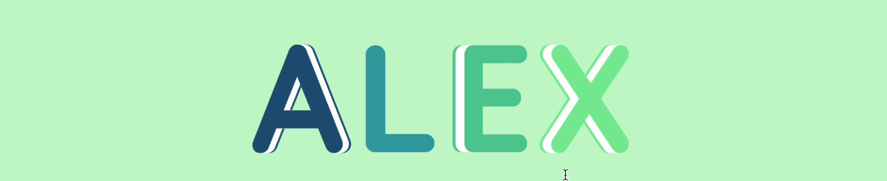

# ALEX 3D Text Animation

A Pen created on CodePen.io. Original URL: [https://codepen.io/ASHISHALEX/pen/MWMdabZ](https://codepen.io/ASHISHALEX/pen/MWMdabZ).


A stunning 3D text animation that spells out "ALEX" using HTML and CSS. Each letter floats and rotates in 3D space, creating an engaging visual effect with a unique color scheme.

## Features

- 3D rotating text animation
- Custom color scheme using CSS variables
- Responsive design (adjusts to viewport size)
- Smooth floating effect using CSS animations
- Utilizes the Quicksand font for a modern look

## Technologies Used

- HTML5
- CSS3 (with CSS Variables)
- Google Fonts (Quicksand)

## Color Palette

The animation uses a custom color palette:

- Lapis Lazuli: #22577a
- Verdigris: #38a3a5
- Emerald: #57cc99
- Light Green: #80ed99
- Tea Green: #c7f9cc

## How to Use

1. Clone this repository:
2. Open the `index.html` file in your web browser.
3. Enjoy the animation!

## Customization

You can easily customize the animation by modifying the CSS variables in the `:root` selector:

```css
:root {
--color-lapis-lazuli: #22577a;
--color-verdigris: #38a3a5;
--color-emerald: #57cc99;
--color-light-green: #80ed99;
--color-tea-green: #c7f9cc;
}

License
This project is open source and available under the MIT License.

Created by Alex
Inspired by https://codepen.io/Metty/details/yLrZxER
